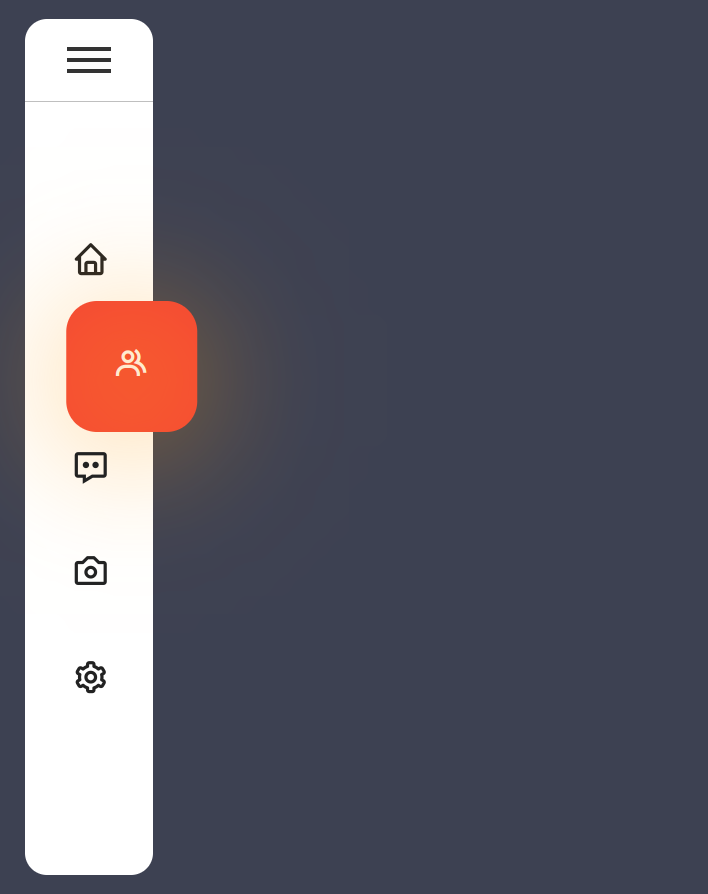
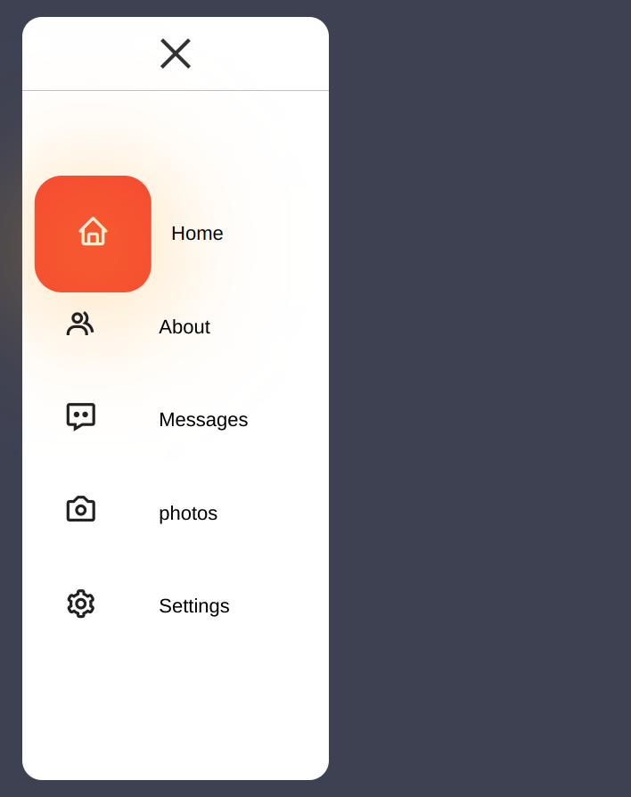
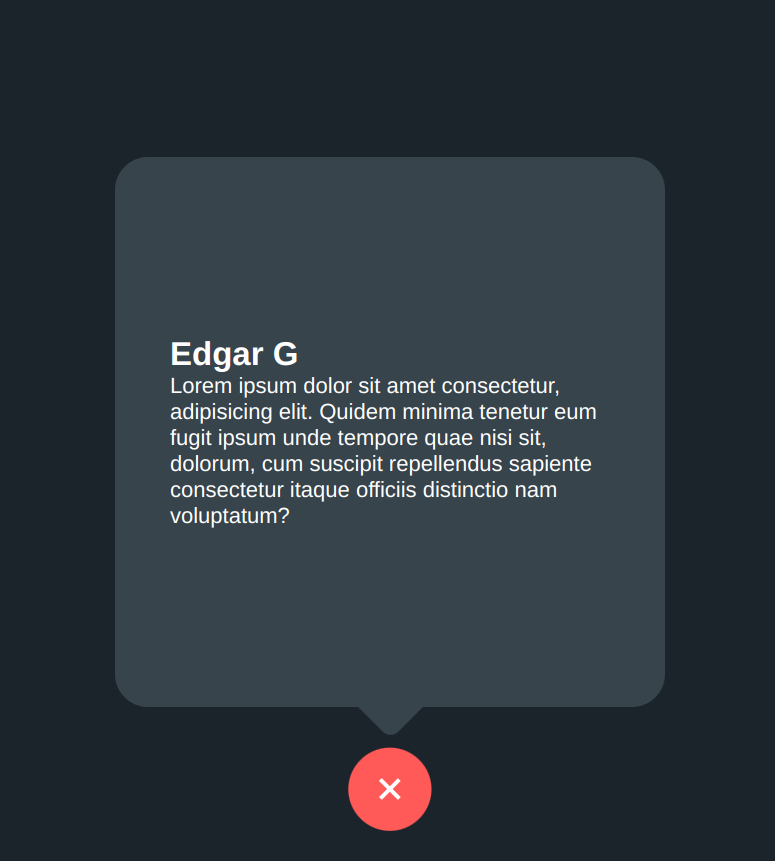

# A Collection of Javascript Projects

Through this project I'll create some basic exercises using Javascript for practicing DOM handle. 

---

## 1-Calculator 
This is a simple calculator that can wich change between two themes.

- Dark theme:

</img>

- Light theme:

</img>

---
## 2-Customized Menu
A drop-down menu with pretty styles 

---
## 3-Toggle
It's a botton that when you click it expands showing a messagge

</img>

</img>
